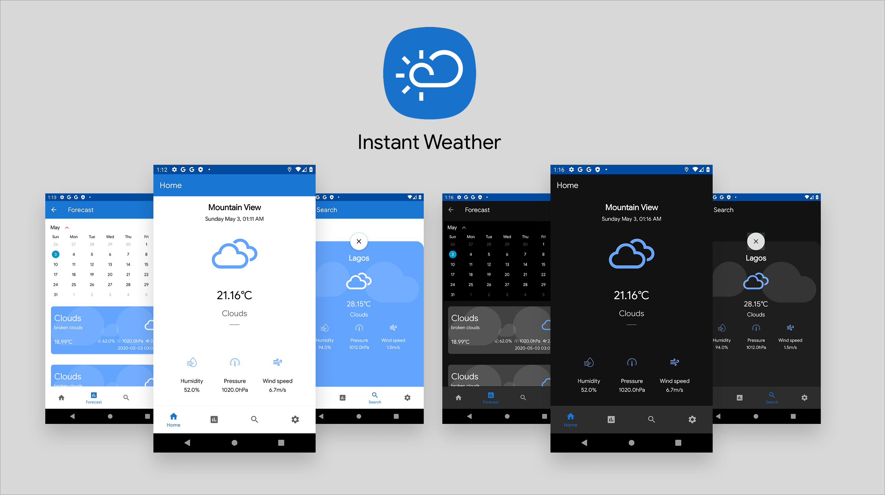

# Instant Weather :partly_sunny:

  [](https://bettercodehub.com/)  

An Android weather application implemented using the MVVM pattern, Retrofit2, Dagger Hilt, LiveData, ViewModel, Coroutines, Room, Navigation Components, Data Binding and some other libraries from the [Android Jetpack](https://developer.android.com/jetpack) . Instant Weather fetches data from the [OpenWeatherMap API](https://openweathermap.org/api) to provide real time weather information. It also makes use of the [Algolia Instant Search](https://www.algolia.com/products/instantsearch/) service which enables you search for weather conditions of various locations.

<a href='https://play.google.com/store/apps/details?id=com.mayokunadeniyi.instantweather&pcampaignid=pcampaignidMKT-Other-global-all-co-prtnr-py-PartBadge-Mar2515-1'></a>

## Architecture
The architecture of this application relies and complies with the following points below:
* A single-activity architecture, using the [Navigation Components](https://developer.android.com/guide/navigation) to manage fragment operations.
* Pattern [Model-View-ViewModel](https://en.wikipedia.org/wiki/Model%E2%80%93view%E2%80%93viewmodel)(MVVM) which facilitates a separation of development of the graphical user interface.
* [Android architecture components](https://developer.android.com/topic/libraries/architecture/) which help to keep the application robust, testable, and maintainable.

<p align="center"><a></a></p>

## Technologies used:

* [Retrofit](https://square.github.io/retrofit/) a REST Client for Android which makes it relatively easy to retrieve and upload JSON (or other structured data) via a REST based webservice.
* [Dagger Hilt](https://dagger.dev/hilt/) for dependency injection.
* [ViewModel](https://developer.android.com/topic/libraries/architecture/viewmodel) to store and manage UI-related data in a lifecycle conscious way.
* [LiveData](https://developer.android.com/topic/libraries/architecture/livedata) to handle data in a lifecycle-aware fashion.
* [Navigation Component](https://developer.android.com/guide/navigation) to handle all navigations and also passing of data between destinations.
* [Timber](https://github.com/JakeWharton/timber) - a logger with a small, extensible API which provides utility on top of Android's normal Log class.
* [Algolia Search API - Android](https://www.algolia.com/doc/guides/building-search-ui/getting-started/android/) to quickly and seamlessly implement search within the application.
* [Work Manager](https://developer.android.com/topic/libraries/architecture/workmanager) to manage Android background jobs.
* [Material Design](https://material.io/develop/android/docs/getting-started/) an adaptable system of guidelines, components, and tools that support the best practices of user interface design.
* [Coroutines](https://kotlinlang.org/docs/reference/coroutines-overview.html) used to manage the local storage i.e. `writing to and reading from the database`. Coroutines help in managing background threads and reduces the need for callbacks.
* [Data Binding](https://developer.android.com/topic/libraries/data-binding/) to declaratively bind UI components in layouts to data sources.
* [Room](https://developer.android.com/topic/libraries/architecture/room) persistence library which provides an abstraction layer over SQLite to allow for more robust database access while harnessing the full power of SQLite.
* [Paging Library](https://developer.android.com/topic/libraries/architecture/paging) helps you load and display small chunks of data at a time.
* [Android KTX](https://developer.android.com/kotlin/ktx) which helps to write more concise, idiomatic Kotlin code.
* [Preferences](https://developer.android.com/guide/topics/ui/settings) to create interactive settings screens.

## Installation
Instant Weather requires a minimum API level of 21. Clone the repository. You will need an API key i.e. `API_KEY` from [Open Weather](https://openweathermap.org/) to request data. If you don’t already have an account, you will need to create one in order to request an API Key. Also, you will need to create an app on [Algolia](https://www.algolia.com/doc/). 

Generate a search only API key i.e. `ALGOLIA_API_KEY`, the APP ID i.e. `ALGOLIA_APP_ID` for the app you created and then create an [Index](https://www.algolia.com/doc/faq/basics/what-is-an-index/) under that app, you will need the index name i.e. `ALGOLIA_INDEX_NAME` to setup the search functionality in this application. You can populate the index with records from [here](https://drive.google.com/file/d/1o-btuAm1bxAwKzd41DP8-1mToTc1QQz-/view?usp=sharing). 

Each record follows this structure:

````JSON
{
    "objectID": "ffe74e4cdddbc_dashboard_generated_id",
    "country": "Zimbabwe",
    "geonameid": 1085510,
    "name": "Epworth",
    "subcountry": "Harare"
}
  
````

In your project's root directory, inside the `local.properties` file (create one if unavailable) include the following lines:

````properties
API_KEY = "YOUR_API_KEY"
ALGOLIA_API_KEY = "YOUR_API_KEY"
ALGOLIA_APP_ID = "YOUR_APP_ID"
ALGOLIA_INDEX_NAME = "YOUR_INDEX_NAME"

````
## Contribution
All contributions are welcome. If you are interested in seeing a particular feature implemented in this app, please open a new issue after which you can make a PR!


## LICENSE
```
MIT License

Copyright (c) 2020 Mayokun Adeniyi

Permission is hereby granted, free of charge, to any person obtaining a copy
of this software and associated documentation files (the "Software"), to deal
in the Software without restriction, including without limitation the rights
to use, copy, modify, merge, publish, distribute, sublicense, and/or sell
copies of the Software, and to permit persons to whom the Software is
furnished to do so, subject to the following conditions:

The above copyright notice and this permission notice shall be included in all
copies or substantial portions of the Software.

THE SOFTWARE IS PROVIDED "AS IS", WITHOUT WARRANTY OF ANY KIND, EXPRESS OR
IMPLIED, INCLUDING BUT NOT LIMITED TO THE WARRANTIES OF MERCHANTABILITY,
FITNESS FOR A PARTICULAR PURPOSE AND NONINFRINGEMENT. IN NO EVENT SHALL THE
AUTHORS OR COPYRIGHT HOLDERS BE LIABLE FOR ANY CLAIM, DAMAGES OR OTHER
LIABILITY, WHETHER IN AN ACTION OF CONTRACT, TORT OR OTHERWISE, ARISING FROM,
OUT OF OR IN CONNECTION WITH THE SOFTWARE OR THE USE OR OTHER DEALINGS IN THE
SOFTWARE.
```
